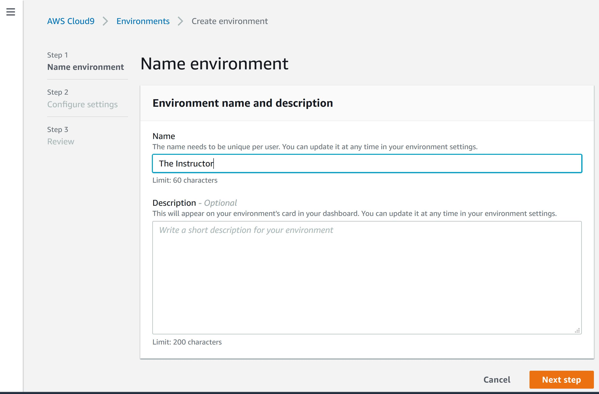
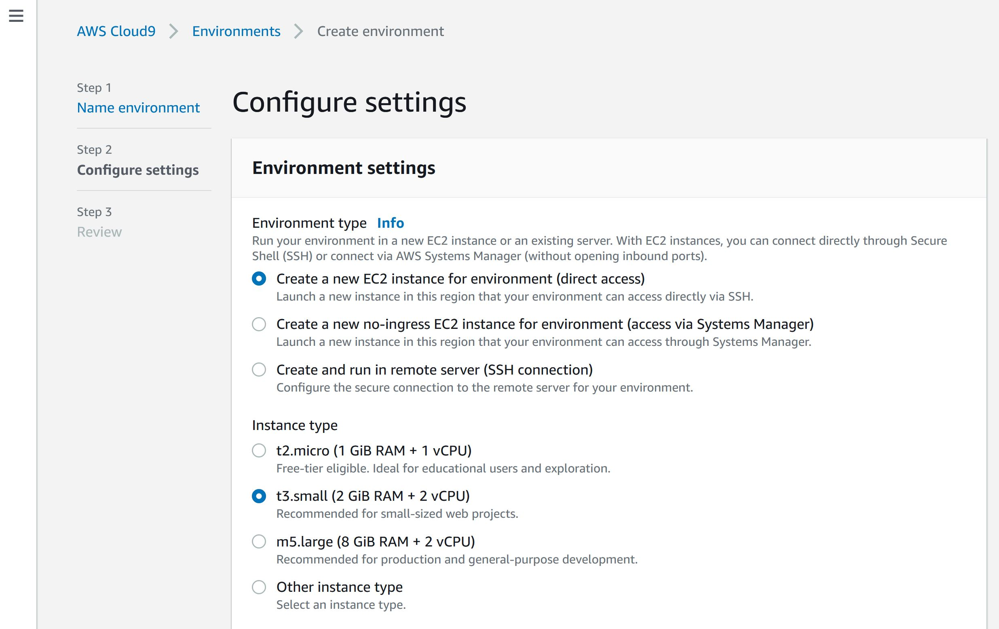
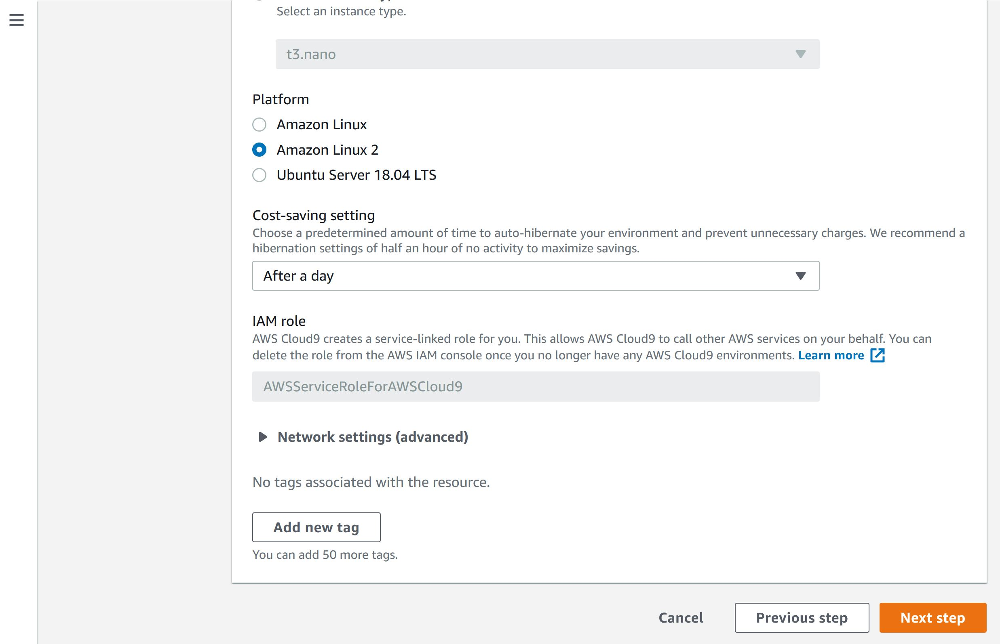

# Creating a Workstation

First login to the AWS Console. Open your browser and navigate to teh AWS Cloud9 Product page:

[https://us-east-2.console.aws.amazon.com/cloud9/home/product](https://us-east-2.console.aws.amazon.com/cloud9/home/product)

> NOTE: Your instructor will provide you with the login information.

Click on the Create Environment button

Enter your name as the `Name` of the new environment. 

> NOTE: Do not use the Name `The Instructor`

Select the following:

+ Environment type: `Create a new EC2 instance for environment (direct access)`

+ Instance type: `t3.small`

* Environment type: `Create a new EC2 instance for environment (direct access)`

